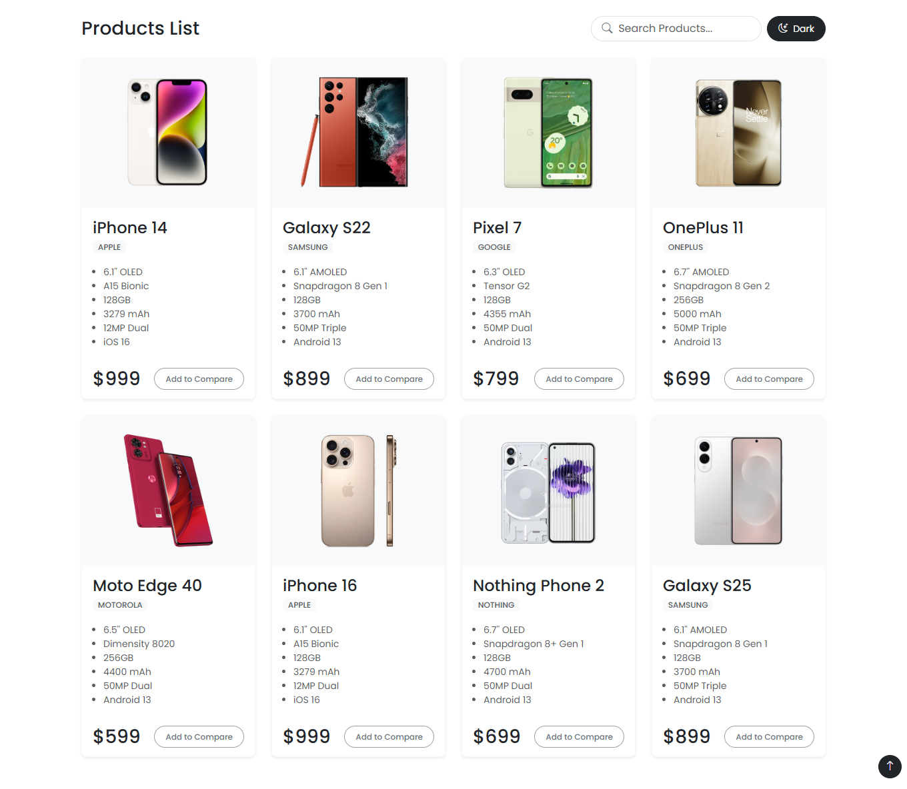
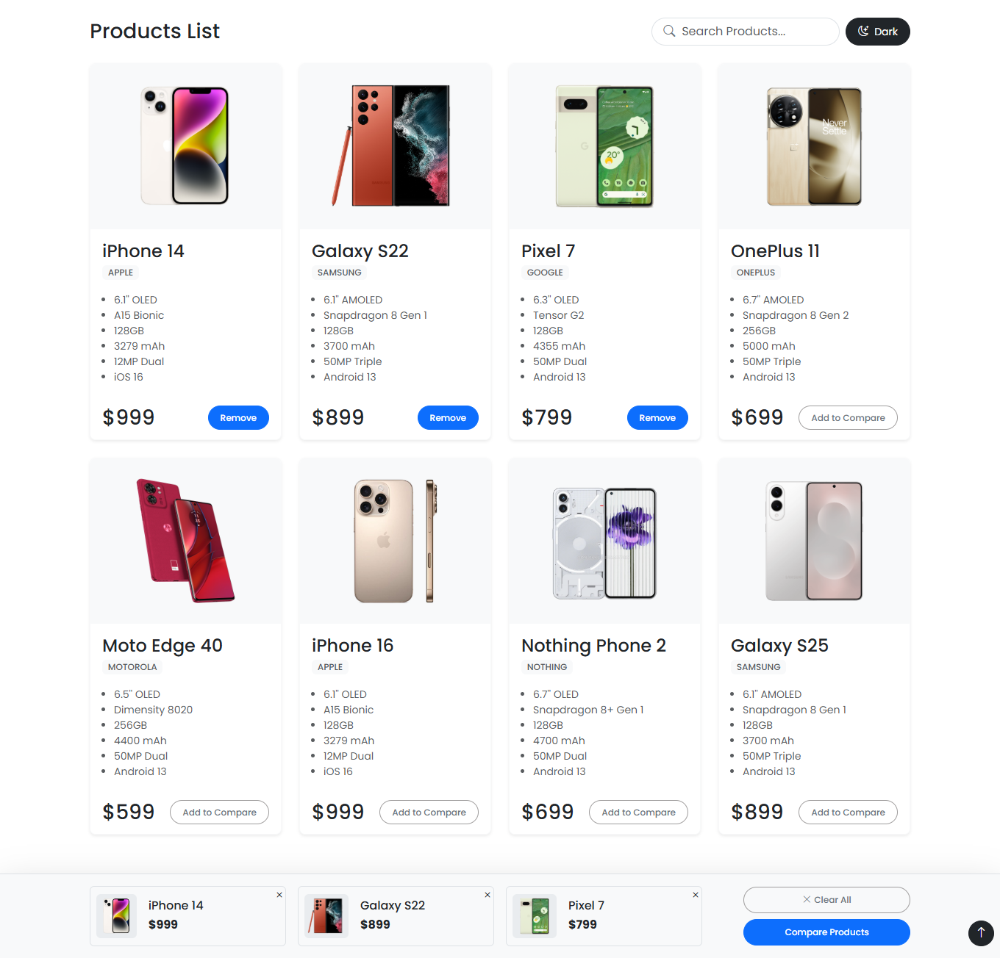

# 🛍️ Product Comparison App

A responsive React-based web application that allows users to search, view, and compare multiple products side-by-side. Built with React, Bootstrap 5, and local storage support.

## 🚀 Live Demo

🔗 [Click here to view the live app](https://product-comparison-app-omega.vercel.app/)

---

## 📸 Screenshots

### 🛒 Product List Page


### 📌 Sticky Comparison Bar


### 🔍 Product Comparison View


### 🌙 Dark Mode


---

## 🛠️ Setup Instructions

To run this project locally:

1. **Clone the repo:**
   ```bash
   git clone https://github.com/RashmiKashyap-UIDeveloper/product-comparison-app.git
   cd product-comparison-app

---

## ✨ Features

- Real-time product search by name or brand  
- Compare up to 3 products side-by-side  
- Sticky comparison bar for quick access  
- Light/Dark theme toggle  
- Persistent selection using local storage  
- Smooth scroll to comparison section  
- Highlights feature differences  
- Responsive UI (Bootstrap 5)  

---

## 🧠 Assumptions

- Product data is static (no API or backend)  
- Each product has the same feature structure  
- Maximum 3 products allowed for comparison  
- Comparison view only shows if ≥ 2 items selected  
- Default theme is light  